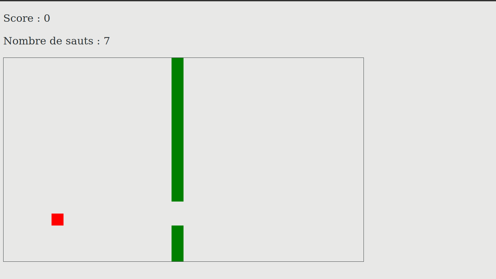
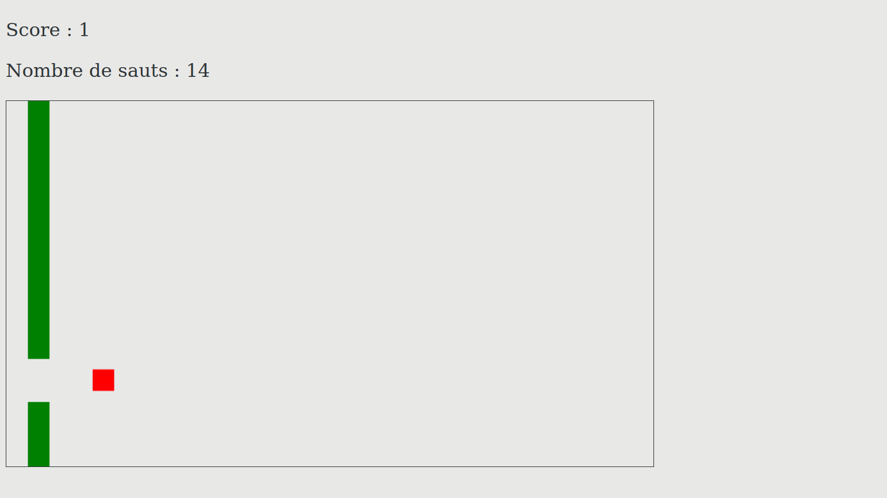
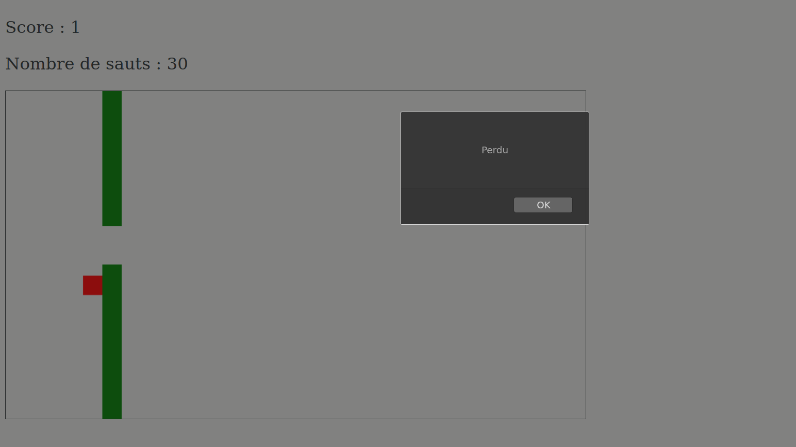

# Flappy Biard

This project is the game of Flappy Bird. 

I did it in 2019, during my 2nd year of university license. This is a personnal project, and is developed in JavaScript. This project is finished.

## Rules
Press on `space` to jump, and avoid the walls. 

## To begin
Do the command :  `$ git clone https://github.com/debroucker/flappy_bird.git` to recover this repository.

## Start-up
Launch `index.html`, and enjoy.

## Made with
Visual Studio Code

## Authors
DEBROUCKER Tommy
